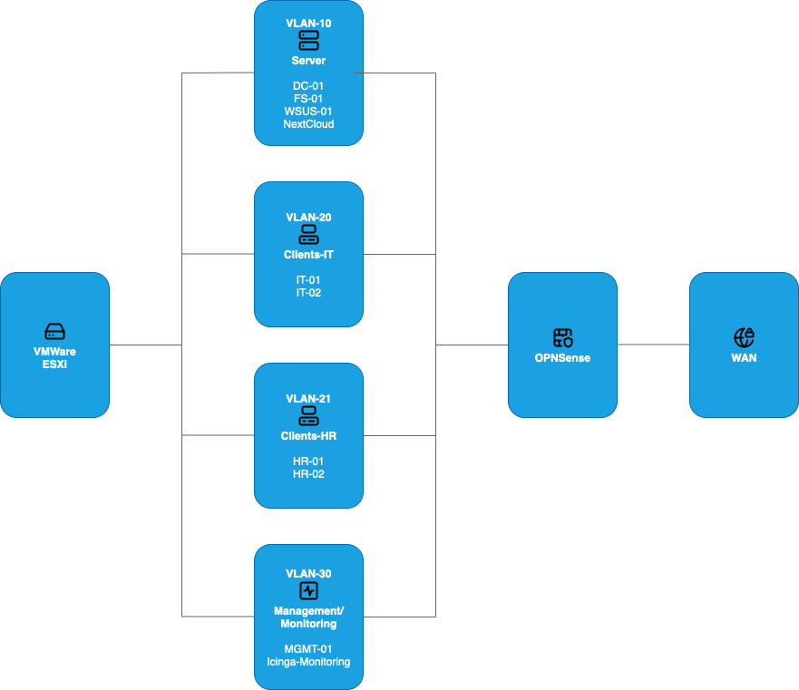

# Enterprise Infrastructure Lab

*A realistic enterprise-style IT environment including identity, security, file services, and hybrid cloud integration.*

---

## Table of Contents
- [Purpose & Overview](#purpose--overview)
- [System Roles & Responsibilities](#system-roles--responsibilities)
- [Architecture Diagram](#architecture-diagram)
- [Network Segmentation & Security](#network-segmentation--security)
- [Active Directory Services](#active-directory-services)
- [Group Policy Implementations](#group-policy-implementations)
- [Hybrid Identity (Microsoft Entra ID)](#hybrid-identity-microsoft-entra-id)
- [Workstations (IT & HR Departments)](#workstations-it--hr-departments)
- [Monitoring & IT Ops Integration](#monitoring--it-ops-integration)
- [Skills Demonstrated](#skills-demonstrated)
- [Related Projects](#related-projects)

---

## Purpose & Overview

This project simulates a **small business IT environment** with fully segmented networks, centralized identity and access management, security policies, and hybrid connectivity to Microsoft cloud services.

It is designed to replicate real IT operations including authentication, workstation management, and controlled service access.

> Domain: **home.lab**  
> Virtualization platform: **VMware ESXi**

---

## System Roles & Responsibilities

| System | OS | Role | Key Services |
|--------|---|------|--------------|
| **DC01** | Windows Server 2025 | Domain Controller | AD DS, DNS, DHCP, LDAP, Kerberos |
| **FS01** | Windows Server 2025 | File Server | SMB Shares, NTFS Permissions |
| **WSUS01** | Windows Server 2025 | WSUS server | Update management |
| **MGMT01** | Windows Server 2025 | Management Server | Windows Admin Center, RSAT |
| **Windows 11 Clients** | Win 11 | Workstations | IT + HR endpoints |
| **Icinga01** *(via Monitoring project)* | Ubuntu Server | Monitoring | Services & host availability |

All systems are joined to the **home.lab** Active Directory domain.

---

## Architecture Diagram

<i>Figure: Logical design of Enterprise Infrastructure</i>

---

## Network Segmentation & Security

This project enforces traffic isolation through **VLAN segmentation** managed by OPNsense.

| VLAN | Subnet | Purpose | Example Systems |
|-----:|--------|---------|----------------|
| 10 | 10.0.10.0/24 | Service Network | DC01, FS01, WSUS01 |
| 20 | 10.0.20.0/24 | IT Clients | IT01, IT02 |
| 21 | 10.0.21.0/24 | HR Clients | HR01, HR02 |
| 30 | 10.0.30.0/24 | Management/Monitoring | MGMT01, Icinga01 |

Security Principle: **Least privilege network access**  
➡ Clients cannot communicate across departments

---

## Active Directory Services

Central identity provider for users and devices:

- DNS integrated with AD DS
- DHCP lease management for clients
- Centralized authentication & user lifecycle

### Organizational Units

- home.lab
  - Users
    - IT
    - HR
  - Computers
    - Servers
      - Domain Controllers
      - File Servers
      - Management Servers
      - Update Services
    - Clients
      - IT
      - HR
 
---

## Group Policy Implementations

Applied for real-world operations and security:

| Policy Type | Configuration |
|------------|---------------|
| **Security Policies** | Password complexity & lockout rules |
| **System Hardening** | Restricted RDP access & admin separation |
| **Branding / UX** | Custom wallpaper for department identity |
| **Update Compliance** | Enforced WSUS client policies |
| **Mapped Network Drives** | Automatic SMB share mounting |
| **Maintenance** | Scheduled update windows |

> GPOs differ per department → IT vs. HR

---

## Hybrid Identity (Microsoft Entra ID)

AD is synced with **Microsoft Entra ID** to enable:

- Cloud identity capabilities
- Seamless login for Microsoft services
- Foundational hybrid architecture

Users benefit from on-prem AD + cloud SSO capabilities.

---

## Workstations (IT & HR Departments)

- Windows 11 clients joined to **home.lab**
- Managed via Group Policies
- Security posture depends on user role
- Zoned via VLAN segmentation

---

## Monitoring & IT Ops Integration

Monitored using **Icinga**:

- Domain controller services
- File & WSUS server health
- Network device availability
- Client reachability

(Full breakdown in Monitoring project)

---

## Skills Demonstrated

- Windows Server identity management (AD DS)
- Group Policy administration & access control
- Enterprise networking: VLAN segmentation & firewalling
- Hybrid cloud identity with Microsoft Entra ID
- NTFS & SMB file service management
- Update rollouts via **WSUS**
- Use of **RSAT** & **Windows Admin Center**

> This lab demonstrates real enterprise IT responsibilities in a controlled learning environment.

---

## Related Projects

🔹 **HomeLab Infrastructure** → `../01-homelab-infrastructure`  
🔹 **Monitoring (Icinga)** → `../03-monitoring`  
🔹 **AI Inference Server** → `../04-ai-inference-server`  
🔹 **Nextcloud Hosting** → `../05-nextcloud-server`  

---
