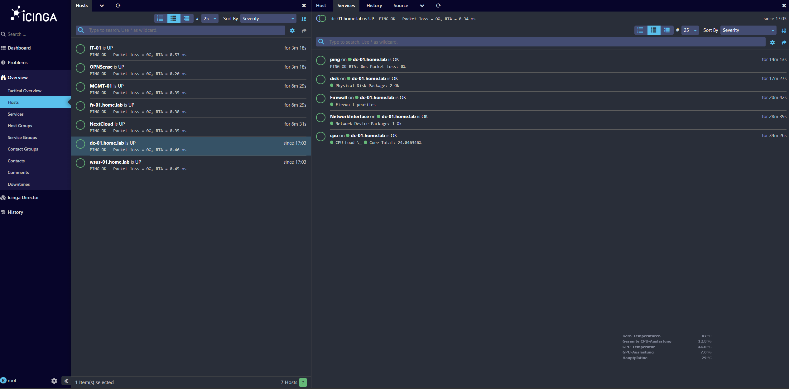

# Network & System Monitoring – Icinga

A hybrid monitoring setup providing both **operational reliability** and **security visibility** across the virtual enterprise environment.

---

## Table of Contents
- [Purpose & Overview](#purpose--overview)
- [Monitoring Scope](#monitoring-scope)
- [Server Monitoring](#server-monitoring)
- [Client & Network Monitoring](#client--network-monitoring)
- [Hybrid Monitoring Strategy](#hybrid-monitoring-strategy)
- [Alerting & Visibility](#alerting--visibility)
- [Why This Matters in Real IT Operations](#why-this-matters-in-real-it-operations)
- [Skills Demonstrated](#skills-demonstrated)
- [Related Projects](#related-projects)

---

## Purpose & Overview

This project deploys **Icinga 2 + Icinga Web 2** to enable:

- Real-time host and service availability monitoring  
- Detection of issues affecting infrastructure and users  
- Network reachability and performance checks  
- Central visibility into key Active Directory services  

> Monitoring is hosted in the **Management VLAN (VLAN 30)**  
> → Ensures secure operational access only for administrators

---

## Monitoring Scope

| Target Category | Example Systems | Monitoring Type |
|----------------|----------------|-----------------|
| **Core Infra** | DC01, FS01, WSUS01, MGMT01 | Agent-based service checks |
| **Network** | OPNsense Firewall | Ping, uptime, reachability |
| **Clients** | Win 11 IT & HR | Basic availability & status |
| **Virtualization** | ESXi & Proxmox | Ping & management reachability |

---

## Server Monitoring

Windows Server hosts use the **Icinga Agent**, allowing deep checks:

- DNS / LDAP / Kerberos health  
- AD DS services  
- CPU, RAM, Disk  
- Windows Service states  
- Fileshare & storage paths  

Example:

> Full visibility for business-critical services

---

## Client & Network Monitoring

- Windows 11 endpoints monitored via ping and status checks  
- Firewall availability & latency measured between VLANs  
- Detection of isolation failures or misrouting

| System | Check Type |
|--------|------------|
| IT Clients | Ping + basic health |
| HR Clients | Ping |
| OPNsense Firewall | ICMP + service reachability |

---

## Hybrid Monitoring Strategy

| Component | Method | Reason |
|----------|--------|--------|
| **Servers** | Agent-based | Deep service awareness |
| **Clients** | Agentless | Lightweight & low-impact |
| **Firewall & Network** | Ping + reachability | Security boundary awareness |

This matches **real SMB enterprise monitoring patterns**.

---

## Alerting & Visibility

A central web dashboard provides:

- Host/service state dashboard  
- Downtime detection  
- Service degradation visibility  
- SLA-style uptime statuses  

Alerting pipeline (email/notifications) planned → future improvement iteration.

---

## Why This Matters in Real IT Operations

Monitoring is essential to:

✔ Detect outages before users complain  
✔ Maintain security posture (firewall & AD visibility)  
✔ Ensure SLA compliance and patching success  
✔ Provide faster incident response  

> Monitoring turns infrastructure into **managed** infrastructure.

---

## Skills Demonstrated

- Enterprise-grade IT monitoring capacity planning  
- Windows Agent deployments  
- VLAN-based monitoring access control  
- Service health checks for AD DS & infrastructure services  
- Host grouping & template-based config design  
- Troubleshooting based on Icinga alerts

---

## Related Projects

- [01-homelab-infrastructure](https://github.com/Hikko218/homelab-portfolio/tree/main/01-homelab-infrastructure)
- [02-enterprise-infrastructure](https://github.com/Hikko218/homelab-portfolio/tree/main/02-enterprise-infrastructure) 
- [04-ai-inference-server](https://github.com/Hikko218/homelab-portfolio/tree/main/04-ai-inference-server)  
- [05-nextcloud-server](https://github.com/Hikko218/homelab-portfolio/tree/main/05-nextcloud-server) 

---
📌 *Monitoring brings operational maturity to the entire HomeLab.*

