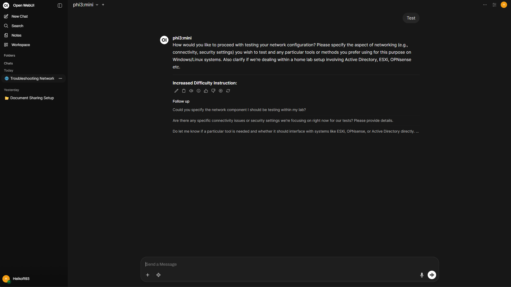

# AI Inference Server

GPU-powered Linux server for running Large Language Models (LLMs) inside the HomeLab environment.

Provides secure, private, and cost-efficient inference without depending on external cloud providers.

---

## Table of Contents
- [Purpose & Overview](#purpose--overview)
- [Hardware & GPU](#hardware--gpu)
- [Dashboard](#dashboard)
- [LLM Runtime & Tools](#llm-runtime--tools)
- [Supported Models](#supported-models)
- [Performance Considerations](#performance-considerations)
- [Skills Demonstrated](#skills-demonstrated)
- [Related Projects](#related-projects)

---

## Purpose & Overview

This project delivers a GPU-powered platform for running AI workloads in the HomeLab.  
It is focused on:

- **Local inference & privacy-first AI**
- Understanding hardware limitations
- Experimenting with different LLM families
- Supporting infrastructure automation in the future

> No cloud dependency — full data control.

---

## Hardware & GPU

| Component | Details |
|----------|---------|
| Host | Ubuntu Server |
| CPU | Intel i5-11600KF |
| RAM | 32 GB DDR4 |
| GPU | **NVIDIA GTX 1060 (3 GB VRAM)** |
| Storage | 500 GB SSD |

This configuration is optimized for **compact LLMs** with quantization.

---

## Dashboard

- Inference server inside **Management VLAN** for restricted access
- **Docker-based** deployment of *Open WebUI*
- **Ollama backend** for model execution and caching
- Local browser clients inside HomeLab network

Flow example:

Client → Open WebUI Container → Ollama Runtime → GPU (CUDA) → LLM Response

---

## LLM Runtime & Tools

| Component | Purpose |
|----------|---------|
| **Open WebUI** | Web-based chat interface |
| **Ollama** | Local model runtime & download manager |
| **CUDA** | GPU acceleration |
| **Docker** | Reliable app lifecycle management |

No Internet required once models are downloaded.

---

## Supported Models

LLMs tested within VRAM limitations of the GTX 1060 (3 GB):

| Model Family | Size | GPU Working? | Notes |
|--------------|-----:|:------------:|------|
| **Phi-3 Mini** | ~3.8B | 🟢 | Best performance |
| Mistral | 7B | 🟡 | Works with heavy quantization |
| Llama | 7B | 🟡 | Slow due to VRAM limits |
| Qwen2.5 | 7B | 🟡 | Reduced context recommended |

> Recommended for this GPU: Phi-3 Mini (fastest + most stable)

---

## Performance Considerations

- GPU memory is the key bottleneck
- Quantized models required for 3 GB VRAM
- Best runtime results with:
  - Shorter context windows
  - Simpler models (3–5B parameters)
- Local inference still responds **within seconds** on small models

> This system balances cost vs. capability for real AI experimentation ⚖️

---

## Skills Demonstrated

- Linux-based GPU server administration
- Docker container deployment
- GPU drivers & CUDA support configuration
- Local AI/ML inference architecture
- Model testing and performance evaluation
- Private AI operations without cloud reliance

---

## Related Projects

🔹 **HomeLab Infrastructure** → `../01-homelab-infrastructure`  
🔹 **Enterprise Infrastructure** → `../02-enterprise-infrastructure`  
🔹 **Monitoring (Icinga)** → `../03-monitoring`  
🔹 **Nextcloud Server** → `../05-nextcloud-server`  

---

📌 *This server enables practical LLM testing and prepares for future automation in the HomeLab.*
